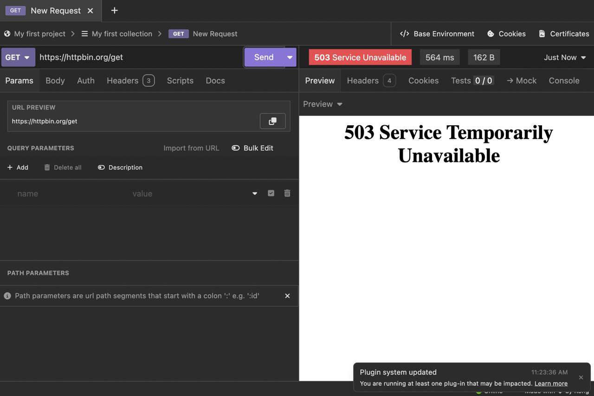
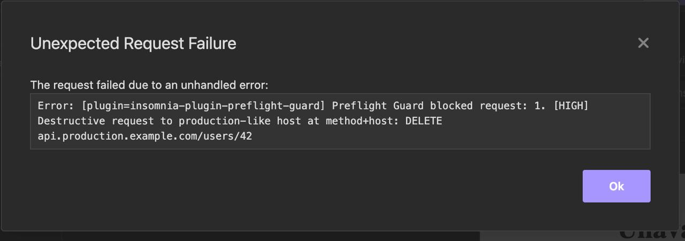
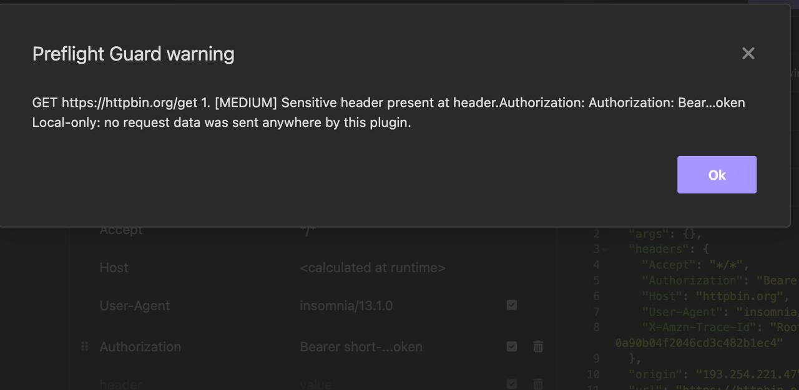
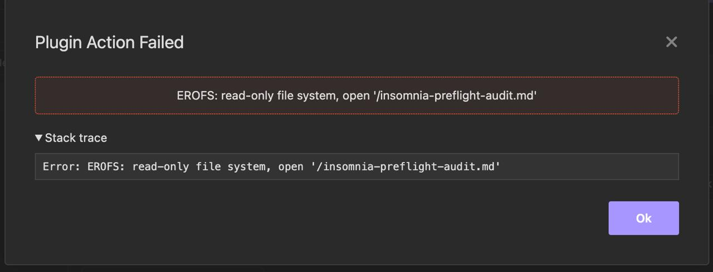
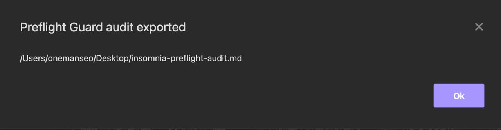

# insomnia-plugin-preflight-guard

[](https://www.npmjs.com/package/insomnia-plugin-preflight-guard)
[](https://www.npmjs.com/package/insomnia-plugin-preflight-guard)
[](LICENSE)

Local-only preflight safety checks for Insomnia requests.

Preflight Guard warns before risky API requests leave your machine: leaked secrets, production mutations, query-string auth, sensitive headers, and redacted workspace audits.

## Why

Most Insomnia plugins help you send requests faster. This one helps you avoid sending the wrong request.

It is designed for developers who work with real API keys, production endpoints, destructive methods, and private collections.

## Features

- Detects common secret leaks in URL, headers, and body
- Warns on auth-like query parameters such as `access_token`, `api_key`, `client_secret`, `token`
- Blocks destructive requests to production-like hosts by default
- Flags sensitive headers with redacted previews
- Adds a workspace action to export a redacted local Markdown audit
- Adds a `Redacted Preview` template tag
- No cloud
- No telemetry
- No backend
- No dependencies

## Demo

Safe request passes normally:



Production-like destructive request is blocked before sending:



Sensitive headers warn with redacted values:



The redacted audit action appears in the New Request dropdown:



Audit export writes a local Markdown file:



## What it catches

- OpenAI-style keys: `sk-...`
- Anthropic keys: `sk-ant-...`
- GitHub tokens: `ghp_...`, `gho_...`, `ghs_...`
- Slack tokens: `xoxb-...`, `xoxp-...`
- AWS access keys: `AKIA...`, `ASIA...`
- Stripe secret/restricted keys
- JWT bearer tokens
- Private key blocks
- Generic `api_key`, `access_token`, `client_secret`, `secret` assignments
- Production-like host mutations using `DELETE`, `PATCH`, `PUT`, or risky `POST` paths

## Install

From Insomnia:

1. Open **Preferences**
2. Go to **Plugins**
3. Enter:

```text
insomnia-plugin-preflight-guard
```

4. Click **Install Plugin**

Manual local install while developing:

```bash
cd ~/.config/Insomnia/plugins
npm install insomnia-plugin-preflight-guard
```

On macOS the plugin folder is:

```text
~/Library/Application Support/Insomnia/plugins/
```

On Windows:

```text
%APPDATA%\Insomnia\plugins\
```

## Usage

### Request guard

Send requests normally. Before a risky request is sent, Preflight Guard analyzes:

- request URL
- query parameters
- method
- headers
- body text

High-risk findings show an alert and block the request by default.

Example blocked request alert:

```text
Request:
DELETE https://api.production.example.com/users/42

Findings:
• [HIGH] Destructive request to production-like host
  Location: method+host
  Preview: DELETE api.production.example.com/users/42
```

Example secret finding:

```text
[HIGH] GitHub token at body: ghp_…abcd
```

### Workspace audit

Use the workspace action:

```text
Preflight Guard: Export Redacted Audit
```

It exports a local Markdown report with redacted findings:

- secret-like values
- production-like URLs
- auth-like query parameters
- duplicate names

The plugin exports with `includePrivate: false` and writes a local `.md` file.

### Redacted Preview template tag

Use the `Redacted Preview` template tag to redact common secret patterns from pasted text.

## Configuration

The default config is local and conservative:

```json
{
  "blockOnHighRisk": true,
  "warnOnMediumRisk": true,
  "prodHostPatterns": ["prod", "production", "live"],
  "destructiveMethods": ["DELETE", "PATCH", "PUT"],
  "riskyPostPathPatterns": ["/delete", "/destroy", "/remove", "/purge", "/admin"],
  "allowedHosts": []
}
```

Future versions may expose a UI for editing config. The MVP uses the safe defaults above.

### Config behavior

- `blockOnHighRisk: true` blocks high-risk requests after showing an alert.
- `blockOnHighRisk: false` shows the alert but allows the request to continue.
- `warnOnMediumRisk: true` shows warnings for sensitive-but-not-blocking findings.
- `allowedHosts` prevents production-host matching for known safe domains.
- `prodHostPatterns` controls host matching for words like `prod`, `production`, and `live`.

Example internal config value:

```json
{
  "blockOnHighRisk": false,
  "allowedHosts": ["prod-sandbox.example.com"]
}
```

## Privacy

Preflight Guard is local-only.

- It does not send request data anywhere.
- It does not use analytics.
- It does not call a backend.
- It does not require an account.
- It does not require API keys.
- It only uses Insomnia plugin APIs and local file writes for audits.

## Development

```bash
git clone https://github.com/oliviajohns5/insomnia-plugin-preflight-guard.git
cd insomnia-plugin-preflight-guard
npm test
npm run test:packaged
npm pack --dry-run
```

## Verified QA

Verified before release:

- `node --check main.js`
- `node --check test.js`
- `node --check real-insomnia-packaged-test.js`
- `node --check qa-packaged.js`
- `npm test`
- `npm run test:packaged`
- `npm pack --dry-run`
- real Insomnia Desktop on macOS manual test:
  - safe request passes
  - production `DELETE` blocks
  - query-string secret blocks
  - sensitive header warns
  - redacted audit export writes a Markdown file

## Plugin Hub

The npm package is public and eligible for Insomnia Plugin Hub indexing:

- npm: https://www.npmjs.com/package/insomnia-plugin-preflight-guard
- GitHub: https://github.com/oliviajohns5/insomnia-plugin-preflight-guard
- Plugin Hub: https://insomnia.rest/plugins

Insomnia Plugin Hub indexing is automatic and may take hours or days after npm publish.

## Publish

The Insomnia Plugin Hub lists public npm packages that:

- start with `insomnia-plugin-`
- include a valid `package.json`
- include the `insomnia` metadata field
- are published as public npm packages

Publish:

```bash
npm publish --access public
```

## Requirements

- Insomnia
- Node.js/npm only for development or npm publishing

## License

MIT
